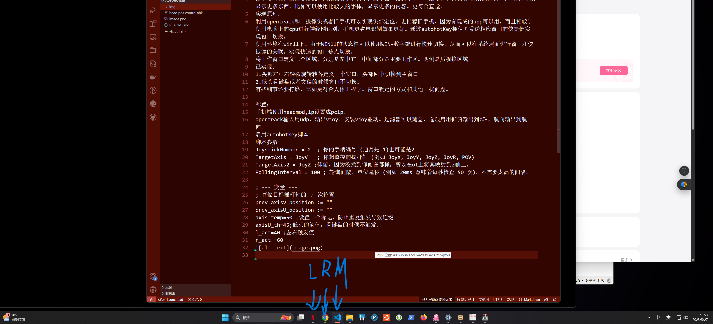

### 这是一个使用头部追踪器来操作电脑的例子
#### 前言：
基于VR系统和模拟驾驶游戏的启发。该项目简单实现类似的功能，使用头部动作进行窗口焦点切换。适合看各种监控，三心二意工作等等。
由于使用窗口的层叠形式，因此相对于窗口平铺的多窗口模式多了一个维度，窗口相对可以比较大。每个窗口可以显示更多东西。比如可以使用比较大的字体，显示更多的内容。更符合直觉。
#### 实现原理：
利用opentrack和一摄像头或者旧手机可以实现头部定位。更推荐旧手机，因为有现成的app可以用，而且相较于使用电脑上的cpu进行神经网识别，手机更省电识别效果更好。通过autohotKey抓值并发送相应窗口的快捷键实现窗口切换。
使用环境在win11下。由于WIN11的状态栏可以使用WIN+数字键进行快速切换，从而可以在系统层面进行窗口和快捷键的关联。实现快速的窗口焦点切换。
将工作窗口定义三个区域，分别是左中右。中间部分是主要工作区。两侧是后视镜区域。
#### 已实现：
1.头部左中右轻微旋转转各定义一个窗口，头部回中切换到主窗口。
2.低头看键盘或者文稿的时候窗口不切换。
- 用手挡脸后进行复位

#### 配置：
ot的复位快捷键是ctrl+shift+/;
手机端使用headmod,ip设置成pcip。
opentrack输入用udp，输出vjoy。安装vjoy驱动。过滤器可以随意。
启用autohotkey脚本
脚本参数：
```JoystickNumber = 2  ; 你的手柄编号 (通是 1)也可能是2
TargetAxis = JoyV   ; 航向，转头你想监控的摇杆轴 (例如 JoyX, JoyY, JoyZ, JoyR, POV)
TargetAxis2 = JoyU ; 仰俯，低头抬头等一些常用习惯
TargetAxis3 = JoyX ; 用于视角锁定   
TargetAxis4 = JoyZ ;用于头部追踪修正
PollingInterval = 100 ; 轮询间隔，单位毫秒 (例如 20ms 意味着每秒检查 50 次)，不需要太高的间隔。

; --- 变量 ---
; 存储目标摇杆轴的上一次位置
prev_axisV_position := ""
prev_axisU_position := ""
axis_temp=50 ;设置一个标记，防止重复触发导致连键
axisU_th=45;低头的阈值，看键盘的时候不触发。
l_act=40 ;左右触发值
r_act =60
V_speed ;引入一个速度阈值，以目前使用习惯大视角的切换明显要比阅读和打字时候头部转角小很多，由此头部微小的移动不认为是视角切换。缺点是看主窗口时头要有足够的速度，所以如果视点在屏幕中间的时候需要多用点力。而且有了瞬时速度可以让窗口切换有提前预判量，降低闪烁问题。
```


#### 关于曲线
由于显示器的长宽比，航向轴适当平坦些，仰副轴需要陡些。这样低头检测可以更灵敏些。  
~~软件有时候会有漂移的情况，光线变换或者座椅位置改变需要在ot上设置快捷键进行回正。结合自己使用习惯进行自动回正也是一种解决办法.~~  
目前回正的方法主要有两种，一种是用手快速从脸前划过，一种是头部z轴移动。  
有些细节还要打磨，比如更符合人体工程学。窗口锁定的方式和其他干扰问题。  
#### 其他想法
- 主窗口可能会随时改变，结合窗口名称将最后前置的作为主窗口。  
- 其他符合人体的曲线。  
- 配置窗口大小和位置。  
~~用z轴进行头部复位~~
- 结合其他有益颈椎的活动进行操作。
- 窗口处理的逻辑。目前不太好。
- 后视镜模式头部回中的阈值判断，轻微的回中不切换到主视角，但是又不能影响主视角的灵敏度，